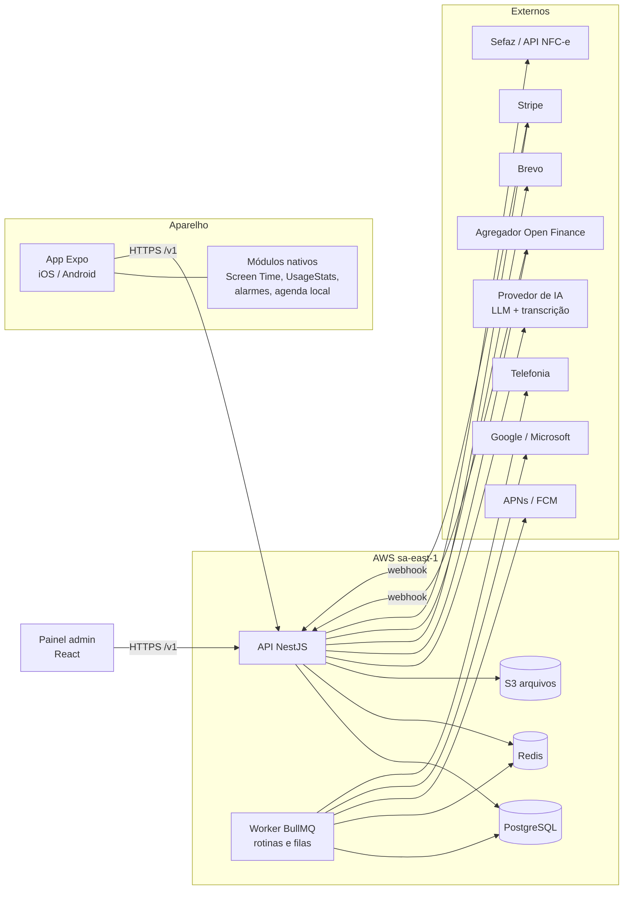

# 01 — Visão geral e escopo

## O produto

O **Monitorizze** é um app nativo de finanças pessoais para iOS e Android. A **Mony** é a assistente de IA que vive dentro do app, em formato de chat. Ela registra gastos por texto, áudio, foto e PDF, responde consultas e age como consultora, mandando alertas, lembretes e dicas no chat e por push.

O sistema anterior (WhatsApp + Evolution API + n8n) **sai por completo**. Não há migração de canal: o app passa a ser a única interface do usuário final.

## Premissas (do PDF)

- Uma única visão financeira por usuário. Não existe perfil empresarial.
- Usuário final usa só o app. Existe um painel web administrativo de uso interno.
- Teste grátis de 3 dias sem cartão. Depois: plano mensal, anual (Stripe, cartão e Pix) ou gratuito com limites. O status é controlado pelo servidor.
- Open Finance importa contas e cartões. Sem conexão, tudo funciona no modo manual e por envio de fatura no chat.

## Fora do escopo

Perfil empresarial, módulo de veículos, importação manual por CSV, seção Universidade, página "como usar" e integração por WhatsApp.

## Módulos

| Módulo | Função | Doc principal |
|---|---|---|
| Conta e acesso | Cadastro, login (e-mail, Google, Apple), biometria, recuperação de senha | [05](05-api-nestjs.md), [11](11-seguranca-e-lgpd.md) |
| Onboarding | Boas-vindas, primeiro lançamento guiado, permissões, checklist | [04](04-app-mobile.md) |
| Mony (chat) | Registro por texto/áudio/foto/PDF, consultas, lembretes, consultoria | [08](08-mony-agente-ia.md) |
| Transações | Receitas e despesas, recorrência, status, anexos | [07](07-regras-de-negocio.md#transações) |
| Cartões de crédito | Limite, faturas, fechamento, vencimento, alertas | [07](07-regras-de-negocio.md#cartões-e-faturas) |
| Parcelamentos e dívidas | Parcelas, progresso, simulação Price | [07](07-regras-de-negocio.md#parcelamentos-e-dívidas) |
| Orçamentos e metas | Limite mensal por categoria, metas de economia | [07](07-regras-de-negocio.md#orçamentos-e-metas) |
| Relatórios | Gráficos, histórico de preços (NFC-e), exportação PDF/XLSX | [05](05-api-nestjs.md) |
| Listas de compras | Listas por categoria, compartilhamento em tempo real, gerar despesa | [07](07-regras-de-negocio.md#listas-de-compras) |
| Lembretes e agenda | Lembretes, alarmes, ligação, agendas externas | [09](09-notificacoes-e-rotinas.md), [10](10-integracoes.md) |
| Notificações | Central de alertas e novidades | [09](09-notificacoes-e-rotinas.md) |
| Contas bancárias | Conexões de Open Finance | [10](10-integracoes.md#open-finance) |
| Categorias | Categorias de receita e despesa | [07](07-regras-de-negocio.md#categorias) |
| Perfil e configurações | Dados, assinatura, preferências, permissões, LGPD | [04](04-app-mobile.md), [11](11-seguranca-e-lgpd.md) |

## Navegação do app

Barra inferior com cinco abas: **Início**, **Transações**, **Mony** (botão central), **Cartões** e **Mais**. As outras telas ficam em "Mais" ou abrem a partir de atalhos e notificações.

## Visão de componentes

Princípios que valem para tudo (do PDF, seção "Regras de arquitetura"):

1. Toda regra de negócio fica no servidor. O app só exibe e coleta dados.
2. A Mony nunca grava no banco direto. Ela chama os mesmos serviços que a API expõe ao app, com as mesmas validações.
3. Cada integração externa fica isolada em módulo próprio, atrás de uma interface, para trocar de fornecedor sem afetar o resto.
4. Dinheiro é sempre inteiro em centavos.
5. O app nunca guarda chaves de IA, Stripe ou Open Finance.

## Glossário

| Termo | Significado |
|---|---|
| Competência | Mês ao qual um valor pertence (orçamento, fatura). Guardado como `date` no dia 1 do mês |
| Fatura | Agrupamento mensal de compras de um cartão, com data de fechamento e vencimento |
| Faixa de alerta | Percentual de uso (ex.: 50/80/100%) que dispara um aviso uma única vez por ciclo |
| Rascunho de lançamento | Transação incompleta que a Mony está montando com perguntas, válida por 24 h |
| Preferência aprendida | Associação estabelecimento → categoria/cartão/forma de pagamento usada para ordenar botões |
| Agregador | Empresa licenciada de Open Finance (Pluggy, Belvo ou Klavi) |
| Consentimento | Autorização do usuário no banco para o agregador ler dados, válida por até 12 meses |
| Recurso limitado | Item com cota no plano gratuito (lançamentos, mensagens, leituras, etc.) |
