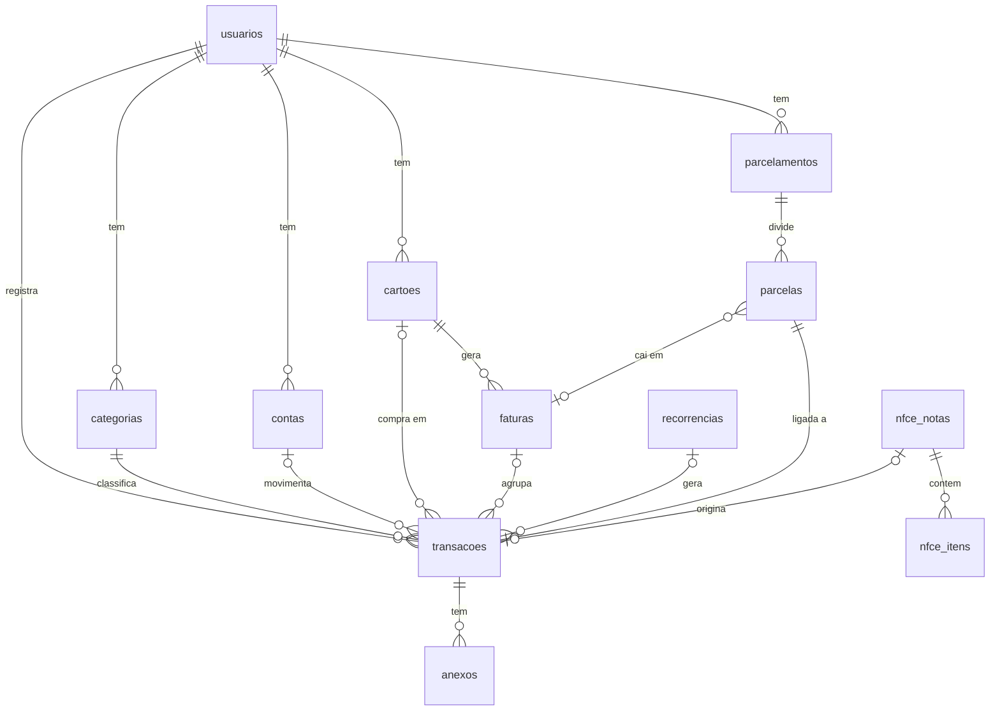

# 06 — Modelo de dados

PostgreSQL com as **41 tabelas** do PDF, agrupadas por módulo, mais as tabelas que propomos no fim deste arquivo.

## Convenções (do PDF, com complementos)

- PK `id` `uuid` (gerado com `uuidv7` na aplicação, ordenável por tempo) **(decisão técnica: v7 em vez de v4 melhora índices)**.
- `criado_em` e `atualizado_em` (`timestamptz`) em todas as tabelas.
- Valores em centavos, `bigint`, nome terminando em valor (`valor`, `valor_total`, `limite_total`). Nunca `numeric` para dinheiro de usuário, nunca `float`.
- Taxa de juros em `numeric(9,6)` (fração mensal, ex.: `0.029900` = 2,99% a.m.).
- Competência e datas de calendário em `date`. Eventos em `timestamptz`.
- Exclusão lógica (`excluido_em`) em `transacoes`, `cartoes`, `parcelamentos` e `categorias`. Extensão do Prisma filtra `excluido_em IS NULL` por padrão.
- Estados como `enum` do Postgres.
- Toda tabela de dados do usuário tem `usuario_id` com índice, e toda consulta filtra por ele.
- Tokens de terceiros (agenda, Open Finance) criptografados na aplicação (ver [11](11-seguranca-e-lgpd.md)).

## Diagrama resumido (finanças)



## Tabelas do PDF

### Conta e assinatura (9)

| Tabela | Campos principais | Relações |
|---|---|---|
| `usuarios` | nome, email (único, minúsculo), telefone, senha_hash, foto_url, papel (`usuario`,`admin`), status (`ativo`,`bloqueado`,`excluido`), onboarding_concluido, ultimo_acesso | raiz |
| `logins_sociais` | provedor (`google`,`apple`), id_externo | usuarios. Único (provedor, id_externo) |
| `dispositivos` | plataforma, token_push, identificador_aparelho, modelo, ultimo_uso | usuarios |
| `sessoes` | refresh_token_hash, dispositivo_id, expira_em, revogada_em | usuarios, dispositivos |
| `codigos_recuperacao` | codigo_hash, expira_em, usado, ip | usuarios |
| `assinaturas` | plano (`teste`,`gratuito`,`mensal`,`anual`), status, teste_inicio, teste_fim, stripe_customer_id, stripe_subscription_id, inicio, proxima_cobranca, cancelamento_agendado, cancelada_em | usuarios, planos_precos |
| `planos_precos` | plano (`mensal`,`anual`), valor, stripe_price_id, vigente, vigente_desde, alterado_por | usuarios (admin) |
| `limites_plano` | recurso, limite_dia, limite_mes | configuração do gratuito |
| `uso_recursos` | recurso, data, quantidade | usuarios. Único (usuario_id, recurso, data) |

### Finanças (11)

| Tabela | Campos principais | Relações |
|---|---|---|
| `categorias` | nome, tipo (`receita`,`despesa`), cor, icone, padrao | usuarios |
| `contas` | nome, tipo (`corrente`,`poupanca`,`carteira`), saldo_inicial, origem (`manual`,`open_finance`), id_externo | usuarios, conexoes_open_finance |
| `cartoes` | nome, bandeira, final, limite_total, dia_fechamento, dia_vencimento, cor, faixas_alerta (`int[]`, padrão `{50,80,100}`), origem, id_externo | usuarios, conexoes_open_finance |
| `faturas` | competencia, data_fechamento, data_vencimento, valor_total, valor_pago, status (`aberta`,`fechada`,`paga`,`parcial`,`atrasada`) | cartoes. Único (cartao_id, competencia) |
| `transacoes` | tipo, descricao, valor, data, status (`pago`,`pendente`), forma_pagamento, origem (`manual`,`mony`,`open_finance`,`foto`), observacao, recorrencia_id, id_externo | usuarios, categorias, contas, cartoes, faturas, parcelas |
| `recorrencias` | frequencia, dia, data_fim, proxima_geracao | usuarios, categorias |
| `parcelamentos` | nome, tipo (`compra_cartao`,`divida`), valor_total, total_parcelas, taxa_juros, data_inicio, status | usuarios, categorias, cartoes |
| `parcelas` | numero, valor, vencimento, status (`pendente`,`pago`,`atrasado`), pago_em | parcelamentos, transacoes, faturas |
| `anexos` | tipo (`foto`,`pdf`,`comprovante`), arquivo_url, tamanho | transacoes ou mensagens |
| `nfce_notas` | chave_acesso (única por usuário), emitente, cnpj, data, total, uf | usuarios, transacoes |
| `nfce_itens` | descricao, quantidade, unidade, valor_unitario, valor_total | nfce_notas |

### Planejamento (6)

| Tabela | Campos principais | Relações |
|---|---|---|
| `orcamentos` | competencia, valor_limite, repetir_mensal | usuarios, categorias. Único (usuario_id, categoria_id, competencia) |
| `metas` | titulo, valor_alvo, valor_atual, prazo, concluida | usuarios |
| `metas_aportes` | valor, data | metas |
| `listas_compras` | nome, categoria_lista (`mercado`,`casa`,`carro`,`farmacia`,`outra`) | usuarios |
| `itens_lista` | nome, quantidade, unidade, preco_estimado, comprado, comprado_em | listas_compras, transacoes |
| `compartilhamentos` | recurso (`lista`,`lembrete`), recurso_id, convidado_id, permissao, status do convite | usuarios |

### Lembretes, agenda e alertas (6)

| Tabela | Campos principais | Relações |
|---|---|---|
| `lembretes` | titulo, data_hora, recorrencia, canais (`push`,`alarme`,`ligacao`), status, adiado_ate | usuarios |
| `agendas_conectadas` | provedor (`google`,`outlook`,`aparelho`), tokens criptografados, agenda_padrao | usuarios |
| `compromissos` | titulo, inicio, fim, local, id_externo, origem | usuarios, agendas_conectadas |
| `notificacoes` | tipo, titulo, corpo, link_interno, enviada_em, lida_em, chave_unica | usuarios. Único (usuario_id, chave_unica) |
| `preferencias_alerta` | tipo_alerta, ativo, antecedencia_dias, silencio_inicio, silencio_fim | usuarios |
| `apps_monitorados` | identificador_app, nome, ativo, ultimo_alerta | usuarios |

### Open Finance (1)

| Tabela | Campos principais | Relações |
|---|---|---|
| `conexoes_open_finance` | agregador, item_id_externo, instituicao, status, consentimento_expira_em, ultima_sincronizacao | usuarios |

### Mony (5)

| Tabela | Campos principais | Relações |
|---|---|---|
| `conversas` | iniciada_em, ultima_mensagem_em | usuarios |
| `mensagens` | autor (`usuario`,`mony`), tipo (`texto`,`audio`,`imagem`,`pdf`,`botao`), conteudo, componentes (`jsonb`), anexo_id | conversas |
| `rascunhos_lancamento` | dados (`jsonb`), campo_pendente, expira_em | usuarios, conversas |
| `preferencias_aprendidas` | chave, categoria_id, cartao_id, forma_pagamento, contagem | usuarios. Único (usuario_id, chave) |
| `logs_ia` | modelo, tokens_entrada, tokens_saida, ferramenta, duracao_ms, erro | usuarios, mensagens |

### Administração (3)

| Tabela | Campos principais | Relações |
|---|---|---|
| `novidades` | titulo, descricao, video_url, publicada_em, validade, status | usuarios (autor) |
| `novidades_leituras` | lida_em | novidades, usuarios |
| `auditoria` | acao, entidade, entidade_id, antes, depois, ip | usuarios |

## Complementos de colunas (proposta)

| Tabela | Coluna | Motivo |
|---|---|---|
| `usuarios` | `fuso_horario` (padrão `America/Sao_Paulo`) | ADR-008: limites diários, silêncio e rotinas no fuso certo |
| `usuarios` | `telefone_verificado_em` | Ligação de voz só para número verificado |
| `transacoes` | `transacao_unida_id` | Registro de união manual × Open Finance (RN-142) |
| `transacoes` | `natureza` (`normal`,`pagamento_fatura`,`transferencia`) | Evita contar pagamento de fatura como despesa duas vezes (RN-037) |
| `transacoes` | `parcelamento_id`, `parcela_id` | Ligação direta à parcela, além do caminho via `parcelas.transacao_id` |
| `transacoes` | `estabelecimento` (texto normalizado) | Base das preferências aprendidas e de "gasto fora do padrão" |
| `transacoes` | `editada_manualmente` | Recorrência não sobrescreve ocorrência editada pelo usuário |
| `transacoes` | `nfce_nota_id` | Histórico de preços e anexo da nota |
| `cartoes` | `conta_pagamento_id` | Conta padrão de onde sai o pagamento da fatura |
| `lembretes` | `ultima_ligacao_em` | Controle do limite mensal de ligações |
| `mensagens` | `rascunho_id`, `idempotency_key` | Rastrear qual rascunho a mensagem completa; evitar duplicata em reenvio |
| `limites_plano` | `limite_quantidade` | Limites por quantidade de itens (cartão, lista, lembrete ativo) do RN-120 (T-007) |
| `parcelamentos` | `valor_financiado`, `observacao` | Valor financiado guardado à parte (RN-052) e observações do cadastro (RN-050) (T-007) |
| `recorrencias` | `tipo`, `descricao`, `valor`, `forma_pagamento`, `conta_id`, `cartao_id`, `data_inicio`, `ativa` | Modelo da ocorrência que a rotina materializa (RN-043) (T-007) |
| `dispositivos` | `ativo` | Token de push inválido desativa o dispositivo (doc 09) (T-007) |
| `codigos_recuperacao` | `tentativas` | No máximo 5 tentativas por código (RN-003) (T-007) |
| `listas_compras` | `finalizada_em` | Finalizar a lista gera a despesa (RN-072) (T-007) |
| `faturas`, `parcelas`, `anexos`, `nfce_itens`, `metas_aportes`, `itens_lista`, `mensagens` | `usuario_id` | Regra "toda tabela de dados do usuário tem `usuario_id`" também nas tabelas filhas (T-007) |

## Tabelas propostas

| Tabela | Campos | Motivo |
|---|---|---|
| `webhook_eventos` | provedor, id_externo (único), tipo, payload, processado_em, erro | Idempotência e reprocessamento de webhooks Stripe e Open Finance |
| `aceites_termos` | documento (`termos`,`privacidade`), versao, aceito_em, ip | LGPD: PDF pede versão e data do aceite |
| `consentimentos` | finalidade (`open_finance`,`agenda`,`apps_compra`,`ligacao`), concedido_em, revogado_em | LGPD: consentimento separado e revogável |
| `controle_teste` | tipo (`email`,`google`,`apple`,`aparelho`), valor_hash, usado_em | Um teste por pessoa (RN-125) |
| `cupons` | codigo, stripe_coupon_id, percentual, validade, ativo, criado_por | CRUD de cupons no admin espelhando a Stripe |
| `mony_config` | versao, prompt_sistema, ferramentas (`jsonb`), modelo, ativo, criado_por | Prompt versionado e editável sem nova versão do app |
| `ligacoes` | lembrete_id, status, provedor_id, custo_centavos, iniciada_em | Custo e limite mensal de ligações |
| `dicas_vistas` | chave, vista_em | Dicas contextuais de primeira visita e checklist de onboarding |
| `importacoes_documento` | arquivo_id, tipo, status, resultado (`jsonb`) | Leitura de fatura PDF/foto com vários lançamentos aguardando confirmação |

Com essas, o banco fica com 50 tabelas. Cada adição é **proposta**: pode ser recusada sem afetar o resto do desenho.

## Índices essenciais

> **Implementação (T-007).** O schema do Prisma não representa índice parcial (`WHERE …`) nem índice por expressão (`to_tsvector`), e o CI compara schema e banco. Por isso a primeira migração tem os índices abaixo sem a cláusula `WHERE` e sem os dois índices GIN de texto; estes entram nas tarefas de busca de transações (T-037) e de histórico de preços (T-066). A T-037 ficou sem o GIN: a busca é `ILIKE` em substring (que o `to_tsvector` não atende) sobre os lançamentos de um usuário só, já filtrados pelo índice de `usuario_id`. Se a busca pesar, a saída é um índice trigram (`pg_trgm`). O índice único de `id_externo` funciona igual sem o `WHERE`, porque o Postgres não compara `NULL` em índice único. Nome de categoria único por usuário e tipo (RN-065) é conferido na aplicação, porque categoria excluída logicamente não pode bloquear o nome.

```sql
-- Listagem e filtros de transações
CREATE INDEX ON transacoes (usuario_id, data DESC) WHERE excluido_em IS NULL;
CREATE INDEX ON transacoes (usuario_id, categoria_id, data) WHERE excluido_em IS NULL;
CREATE INDEX ON transacoes (fatura_id);
CREATE UNIQUE INDEX ON transacoes (usuario_id, id_externo) WHERE id_externo IS NOT NULL;
-- Busca por texto
CREATE INDEX ON transacoes USING gin (to_tsvector('portuguese', descricao));
-- Faturas e parcelas por vencimento (rotinas)
CREATE INDEX ON faturas (data_vencimento, status);
CREATE INDEX ON parcelas (vencimento, status);
-- Lembretes por minuto
CREATE INDEX ON lembretes (data_hora) WHERE status = 'ativo';
-- Histórico do chat
CREATE INDEX ON mensagens (conversa_id, criado_em DESC);
-- Histórico de preços
CREATE INDEX ON nfce_itens USING gin (to_tsvector('portuguese', descricao));
```

## Dados iniciais (seed)

- Categorias padrão criadas no cadastro (lista a confirmar com o cliente; sugestão: Alimentação, Mercado, Transporte, Moradia, Saúde, Educação, Lazer, Compras, Assinaturas, Contas, Outros; receitas: Salário, Freelance, Rendimentos, Outros).
- `limites_plano` com os valores sugeridos do PDF (ver RN-120).
- Lista sugerida de apps de compra: Shopee, Mercado Livre, Amazon, Shein, AliExpress, Magalu, iFood.
- `preferencias_alerta` com todos os tipos ligados.
