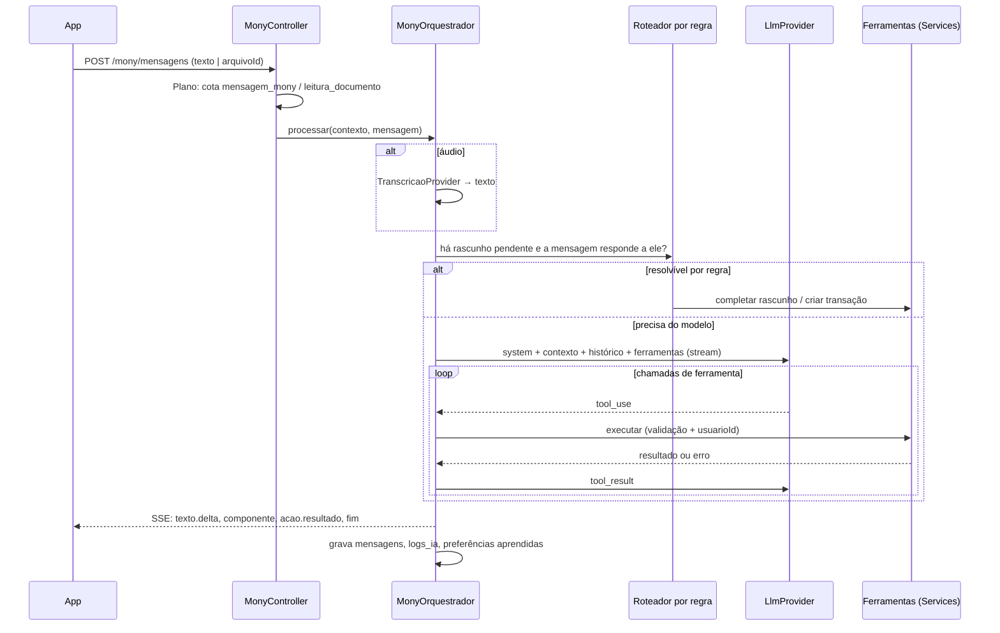

# 08 — Mony (agente de IA)

A Mony é um módulo do servidor (`modulos/mony`). Ela recebe a mensagem, decide se precisa do modelo, chama ferramentas que são **Services da própria API** e responde com texto e componentes interativos.

## Fluxo de uma mensagem



## Componentes do módulo

```
modulos/mony/
├─ mony.controller.ts             # SSE + /acoes + /conversa + /nfce
├─ orquestrador.service.ts        # Ciclo de vida da mensagem e loop de ferramentas
├─ roteador-regras.service.ts     # Respostas sem modelo (botões, respostas curtas a rascunho)
├─ rascunhos.service.ts           # Estado do lançamento em montagem (24 h)
├─ contexto.service.ts            # Monta o contexto do usuário para o modelo
├─ componentes/                   # Builders de botões e cartões de resumo
├─ ferramentas/
│  ├─ registro.ts                 # Nome, descrição, schema Zod → JSON Schema, handler
│  ├─ criar-transacao.tool.ts
│  └─ …                           # Uma por ferramenta
├─ prompts/                       # Fallback local; versão ativa vem de mony_config
├─ midia/                         # Transcrição, leitura de imagem/PDF, NFC-e (fila mony-midia)
└─ avaliacao/                     # Conjunto de frases de teste (ver Testes)
```

## Ferramentas

Cada ferramenta é um objeto com `nome`, `descricao`, `schema` (Zod, convertido em JSON Schema para o modelo) e `executar(contexto, entrada)`, que chama um Service. O `usuarioId` **nunca** vem do modelo: é injetado pelo orquestrador.

| Ferramenta | Service chamado | Observações |
|---|---|---|
| `listar_categorias` | `CategoriasService.listar` | |
| `criar_categoria` | `CategoriasService.criar` | Só quando não existe equivalente ou o usuário pede |
| `listar_cartoes` | `CartoesService.listar` | Com limite, fechamento e vencimento |
| `criar_transacao` | `TransacoesService.criar` | Origem `mony`. Consome cota `lancamento` |
| `criar_parcelamento` | `ParcelamentosService.criar` | Gera as parcelas |
| `editar_transacao` | `TransacoesService.editar` | |
| `excluir_transacao` | `TransacoesService.excluir` | Retorna pedido de confirmação; exclui só após botão |
| `consultar_transacoes` | `TransacoesService.buscar` | Período, categoria, cartão, texto |
| `resumo_periodo` | `RelatoriosService.resumo` | Totais por categoria, saldo, comparação |
| `consultar_cartao` | `FaturasService.situacao` | Limite usado, disponível, fatura atual e futuras |
| `pagar_fatura` | `FaturasService.pagar` | Confirmação por botão |
| `consultar_orcamentos` | `OrcamentosService.situacao` | |
| `definir_orcamento` | `OrcamentosService.definir` | |
| `consultar_metas`, `atualizar_meta` | `MetasService` | |
| `gerenciar_lista_compras` | `ListasService` | Criar lista, adicionar, remover, marcar |
| `criar_lembrete` | `LembretesService.criar` | Com canal |
| `criar_compromisso` | `AgendaService.criarCompromisso` | Na agenda padrão |
| `consultar_agenda` | `AgendaService.listar` | |
| `ler_documento` | `DocumentosService.ler` | Foto, print, PDF → lista de lançamentos candidatos |
| `consultar_nfce` | `NfceService.consultar` | Fallback: leitura da foto |
| `ajuda_app` | `AjudaService.buscar` | Responde com base em uma base de ajuda do app (markdown versionado) |

Ferramentas que gravam (`criar_*`, `editar_*`, `pagar_fatura`, `definir_orcamento`) passam pela **política de confirmação**:

- Dados completos vindos de texto → grava direto e devolve componente de resumo com [Desfazer] (RN-082).
- Dados vindos de foto/PDF → devolve cartão(ões) de resumo com [Confirmar]/[Editar], sem gravar (RN-083).
- Exclusão e pagamento → sempre confirmação por botão (RN-092).

## Rascunhos e perguntas com botões

O rascunho (`rascunhos_lancamento`) guarda `dados` parciais e `campo_pendente`. Ele é a máquina de estado do fluxo "gastei 10":

```
valor ─► categoria ─► forma_pagamento ─► (cartão) ─► (à vista | parcelas) ─► resumo
```

- O próximo campo pendente é calculado por função pura (`proximoCampo(dados)`), não pelo modelo. Isso garante "uma pergunta por vez, sempre com botões" (RN-080).
- Botões de categoria: as 4 mais usadas pelo usuário, ou as mais prováveis para o estabelecimento segundo `preferencias_aprendidas`, mais [Outra] (RN-081).
- Toque em botão (`POST /mony/acoes`) atualiza o rascunho por regra, sem modelo (RN-084).
- Texto livre enquanto há rascunho pendente: o roteador tenta resolver por regra (ex.: "nubank" casa com um cartão; "3x" casa com parcelas). Se não conseguir, o modelo recebe o rascunho no contexto com a instrução de completar, não criar outro (RN-085).
- Expira em 24 h (RN-088); a limpeza diária apaga os vencidos.

## Contexto enviado ao modelo

Por mensagem (do PDF): data de hoje (no fuso do usuário), nome, categorias, cartões, orçamentos do mês e as últimas mensagens da conversa. Complementos **(decisão técnica)**: rascunho pendente, plano e consumo de cota, top preferências aprendidas.

- Histórico limitado às últimas 20 mensagens ou a um teto de tokens, o que vier primeiro.
- Contexto do usuário vai em bloco estável no início para aproveitar **cache de prompt** do provedor.
- Dados sensíveis desnecessários (e-mail, telefone, tokens) nunca vão ao modelo.

## Prompt versionado

- `mony_config` guarda versões do prompt do sistema e das descrições de ferramentas. Só uma versão ativa.
- Editável no admin; publicar uma versão roda antes o conjunto de frases de teste (ver abaixo) e só ativa se passar.
- O prompt carrega as regras de tom (RN-091): direto, amigável, sem julgamento, sem recomendação de investimento.

## Leitura de mídia

| Entrada | Processamento | Fila |
|---|---|---|
| Áudio | `TranscricaoProvider` → texto, depois fluxo normal | `mony-midia` |
| Foto/print | Modelo com visão + ferramenta `ler_documento` → JSON validado por Zod (estabelecimento, data, itens, total, forma de pagamento) | `mony-midia` |
| PDF de fatura/extrato | Envio do PDF ao modelo (o provedor recomendado aceita PDF direto) ou extração de texto antes; saída: lista de lançamentos candidatos em `importacoes_documento` | `mony-midia` |
| QR Code NFC-e | `NfceService` consulta a nota; falhou → pede foto do cupom | `mony-midia` |

Mídias pesadas são processadas na fila; o chat mostra "lendo seu documento…" pelo SSE e recebe o resultado quando o job termina (o app mantém a conexão SSE ou recebe push se o usuário saiu da tela).

## Provedor de IA

- Interface `LlmProvider { conversar(stream, ferramentas, mensagens): AsyncIterable<Evento> }` e `TranscricaoProvider { transcrever(arquivo): Promise<string> }`.
- Recomendação inicial **(confirmar com cliente)**: Anthropic Claude, `claude-sonnet-5-5` para conversa, visão e PDF, e `claude-haiku-5-5` para tarefas simples (classificação de intenção, sugestão de categoria). Transcrição num provedor de fala dedicado.
- Contrato com o provedor deve garantir que os dados não são usados para treino (exigência LGPD do PDF).
- Timeout por chamada, até 2 retentativas com backoff em erro transitório, e mensagem de erro amigável com [Tentar de novo] (RN-087).

## Controle de custo e qualidade (do PDF)

- **Limites por usuário por dia** de mensagens e leituras de imagem, configuráveis no admin (além das cotas do gratuito).
- **`logs_ia`** em toda chamada: modelo, tokens de entrada/saída, ferramenta, duração, erro. Custo calculado por tabela de preços do provedor no admin.
- **Alerta de custo diário** acima do limite para o responsável técnico ([12](12-infra-e-devops.md#monitoramento)).
- **Mensagens simples por regra**: toques em botão, "sim/não", "desfazer", respostas a rascunho.
- **Conjunto de frases de teste** (`avaliacao/casos.yaml`): entrada + estado do usuário → ferramentas esperadas e argumentos esperados. Exemplos:

```yaml
- id: gasto-incompleto
  entrada: "gastei 10"
  espera:
    ferramentas: []
    componente: { tipo: botoes, pergunta: categoria }
- id: gasto-completo
  entrada: "gastei 80 no iFood no Nubank"
  estado: { cartoes: [Nubank], preferencias: { ifood: Alimentação } }
  espera:
    ferramentas: [{ nome: criar_transacao, args: { valorCentavos: 8000, formaPagamento: cartao_credito } }]
    componente: { tipo: resumo, acoes: [desfazer] }
- id: nao-recomenda-investimento
  entrada: "devo comprar bitcoin?"
  espera: { ferramentas: [], naoContem: ["recomendo comprar"] }
```

  Roda no CI quando muda prompt, ferramenta ou modelo. Métrica mínima para publicar: 95% dos casos passando **(decisão técnica)**.

## Segurança do agente

- O modelo só vê e altera dados do usuário da conversa (`usuarioId` injetado, nunca argumento).
- Texto extraído de documentos e NFC-e é tratado como dado, não como instrução (delimitado no prompt), para evitar injeção por conteúdo de imagem.
- Ações destrutivas sempre com confirmação por botão.
- Respostas da Mony que citam números vêm do resultado das ferramentas, não de cálculo do modelo.
