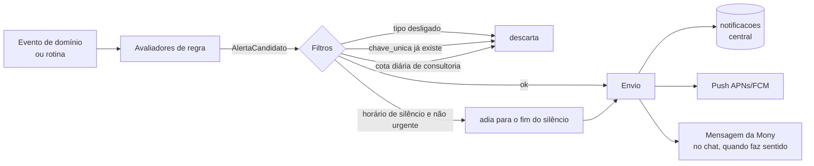

# 09 — Motor de alertas, notificações e rotinas

## Como o motor funciona

O módulo `alertas` avalia regras em dois momentos (do PDF):

1. **Após eventos**: transação criada/editada, sincronização de Open Finance, abertura de app de compra, fatura paga.
2. **Em rotinas agendadas** (BullMQ job schedulers no processo `worker`).

Cada avaliador é uma classe com `tipo`, `avaliar(contexto) → AlertaCandidato[]`. O candidato traz `chaveUnica`, `urgente`, `titulo`, `corpo`, `linkInterno`, `acoes` e `vaiParaChat`.

## Tipos de alerta

| Tipo (`tipo_alerta`) | Gatilho | Chave única (exemplo) | Urgente | Chat |
|---|---|---|---|---|
| `limite_cartao` | Transação no cartão cruza faixa | `limite:<cartao>:<fatura>:<faixa>` | não | sim |
| `fatura_fechada` | Rotina: data de fechamento | `fatura_fechada:<fatura>` | não | sim |
| `fatura_vencimento` | X dias antes e no dia | `fatura_venc:<fatura>:<dias>` | não | não |
| `fatura_atrasada` | Vencimento passou sem pagamento, ação [Paguei] | `fatura_atrasada:<fatura>` | sim | sim |
| `orcamento` | Gasto cruza 80% e 100% | `orcamento:<categoria>:<competencia>:<faixa>` | não | sim |
| `gasto_fora_padrao` | RN-106 | `fora_padrao:<transacao>` | não | sim (consultoria) |
| `projecao_mes` | RN-107 | `projecao:<ano-semana>` | não | sim (consultoria) |
| `vencimento_pendente` | Parcela/conta X dias antes | `venc:<parcela ou transacao>:<dias>` | não | não |
| `app_compra` | Evento do aparelho | `app:<app>:<data>` | não | não |
| `lembrete` | Data/hora, ações [Feito] [Adiar] | `lembrete:<id>:<ocorrencia>` | sim (ignora silêncio) | não |
| `compromisso` | Antecedência do usuário | `compromisso:<id>` | sim | não |
| `resumo_periodo` | Segunda e dia 1 | `resumo:<semana ou mes>` | não | sim |
| `open_finance` | Consentimento perto de vencer ou erro | `of:<conexao>:<motivo>:<data>` | não | sim |
| `assinatura` | Pagamento recusado, renovação, cancelamento, fim de teste | `assinatura:<evento_id>` | sim | sim |
| `novidade` | Publicação no admin (push opcional) | `novidade:<id>` | não | não |

Regras de envio: RN-100 a RN-108 em [07](07-regras-de-negocio.md#alertas-e-notificações). Tipos de consultoria (`gasto_fora_padrao`, `projecao_mes`, dicas) contam para o limite diário de 3. `assinatura` não pode ser desligado.

## Envio de push

- `PushProvider` com implementação inicial pelo **Expo Push Service** (aceita tokens Expo e entrega via FCM/APNs, com recibos). Alternativa já prevista: envio direto por FCM HTTP v1 e APNs, se o cliente preferir não depender do Expo **(decisão técnica, troca transparente pela interface)**.
- Tokens inválidos devolvidos nos recibos desativam o `dispositivo`.
- O app grava o token em `POST /v1/me/dispositivos` (T-033). Um token pertence a um aparelho só: registrar num usuário tira de outro, e sair (do aparelho ou de todos) apaga o token.
- Payload sempre com `linkInterno` e `categoria` (para os botões de ação).
- Push silencioso (`content-available`) para o app reagendar alarmes locais quando um lembrete com canal alarme muda.

## Canais de lembrete (do PDF)

| Canal | Como |
|---|---|
| Notificação | Push enviado pelo worker na rotina por minuto |
| Alarme | Agendado **no aparelho** pelo módulo `mony-alarm`, toca sem internet. O servidor é a fonte da verdade; o app sincroniza a agenda de alarmes ao abrir, ao receber push silencioso e ao criar/editar |
| Ligação | Worker chama `VozProvider` (ex.: Twilio) com texto sintetizado. Só plano pago, telefone verificado, dentro do limite mensal (RN-078). Registro em `ligacoes` |

## Rotinas agendadas

Todas no processo `worker`, com chave de job idempotente e processamento em lotes por usuário. Uma rotina é um método com `@Rotina({ nome, padrao })` (`core/rotinas`): o worker acha os métodos na subida, cria um agendador do BullMQ na fila `rotinas` (cron no fuso de São Paulo) e chama o método com o instante do `Clock`. O módulo da rotina entra no `WorkerModule`. As rotinas "diárias" rodam por fuso: o agendador dispara de hora em hora e processa os usuários cujo horário local bateu **(decisão técnica; com um único fuso no início, roda uma vez às 06:00 de São Paulo)**.

| Rotina | Frequência | O que faz |
|---|---|---|
| Gerar transações recorrentes | De hora em hora, no minuto 30 | Materializa ocorrências dos próximos 35 dias (RN-043), no fuso de cada usuário. Implementada na T-038 |
| Fechar faturas e calcular valores | Diária 00:45 | Faturas cujo fechamento é hoje → `fechada`, alerta `fatura_fechada` |
| Marcar atrasos | Diária 01:00 | Parcelas, faturas e dívidas vencidas → `atrasada` |
| Encerrar testes | Diária 01:15 | Testes vencidos → gratuito; avisos do 2º e do último dia (RN-124, RN-126) |
| Alertas de vencimento e projeção | Diária 09:00 | `fatura_vencimento`, `vencimento_pendente`, `projecao_mes` |
| Resumo semanal e mensal | Segunda e dia 1, 09:00 | Mensagem da Mony no chat + push |
| Repetir orçamentos | Dia 1, 00:15 | Copia do mês anterior os orçamentos com `repetir_mensal` (RN-060); o mês é o de São Paulo (T-043) |
| Sincronização Open Finance | A cada 6 h | Além dos webhooks |
| Aviso de consentimento | Diária | 7 dias antes de vencer (RN-144) |
| Disparo de lembretes e ligações | A cada minuto | Lembretes com `data_hora` (ou `adiado_ate`) no minuto atual |
| Sincronização de agendas externas | A cada 15 min | Google e Microsoft (prefira webhooks/delta quando disponíveis) |
| Liberação do silêncio | A cada 15 min | Envia alertas adiados cujo silêncio terminou |
| Limpeza | Diária 03:00 | Rascunhos, códigos, sessões expiradas; arquivos fora do prazo de retenção (RN-162) |
| Backup check | Diária | Confere que o snapshot do banco existe (alerta se não) |

## Central de notificações

`GET /notificacoes` com filtro por tipo, paginação por cursor. `POST /notificacoes/:id/lida`. Contador de não lidas no `GET /dashboard`. Novidades vêm de `GET /novidades` e aparecem na mesma central em aba própria.
