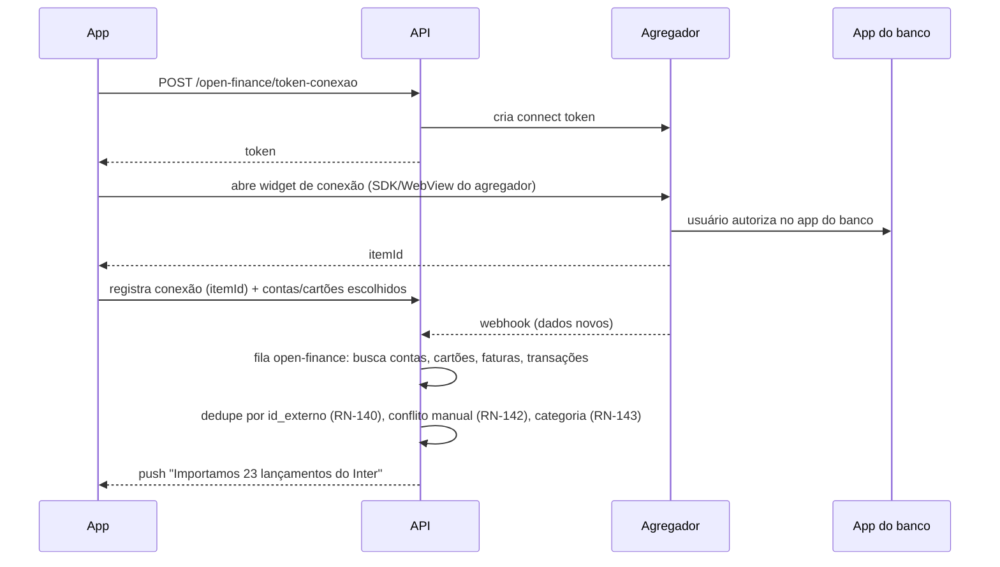

# 10 — Integrações externas

Regra geral (do PDF): cada integração fica num módulo isolado em `apps/api/src/integracoes/<nome>`, atrás de uma interface, com credenciais no cofre de segredos e nunca no app. Toda integração tem implementação **fake** para desenvolvimento e testes.

| Integração | Interface | Fornecedor inicial | Ambiente de homologação |
|---|---|---|---|
| Open Finance | `OpenFinanceProvider` | Pluggy, Belvo ou Klavi (cotar) | Sandbox do agregador |
| Pagamentos | `BillingProvider` | Stripe | Stripe test mode |
| Agenda | `CalendarProvider` | Google Calendar API, Microsoft Graph; no aparelho EventKit/CalendarContract via `expo-calendar` | Contas de teste |
| Apps de compra | módulo nativo `mony-app-usage` | Screen Time (iOS), UsageStatsManager (Android) | Aparelhos reais |
| NFC-e | `NfceProvider` | API de terceiros que padronize as Sefaz (avaliar) ou leitor próprio por UF | Cupons reais de teste |
| IA | `LlmProvider`, `TranscricaoProvider` | Ver [08](08-mony-agente-ia.md#provedor-de-ia) | Mesmo provedor, chave separada |
| Push | `PushProvider` | Expo Push (FCM/APNs) | Builds de teste |
| Voz | `VozProvider` | Twilio (ou equivalente) | Números de teste |
| E-mail | `EmailProvider` | Brevo (já usado hoje) | Conta de teste |

## Open Finance

Fluxo (do PDF):

- Widget do agregador: usar o SDK React Native oficial do agregador escolhido se existir, senão `react-native-webview` com a URL de conexão. **Verificar na PoC** se o redirecionamento para o app do banco e a volta funcionam no Expo (deep link de retorno).
- `conexoes_open_finance.status`: `ativa`, `atualizando`, `erro_login`, `consentimento_expirado`, `desconectada`.
- Desconectar: revoga no agregador, mantém os lançamentos importados (o usuário pode apagá-los) **(decisão técnica)**.
- Custo: o PDF cita Pluggy a partir de R$ 2.500/mês com excedente por uso. Recurso exclusivo de plano pago (RN-121). Cotar Belvo e Klavi **(pendência do cliente)**.

## Stripe

- **Produtos/preços:** um produto "Monitorizze" com `Price` mensal e anual. Mudança de valor pelo admin cria novo `Price` e marca como vigente (RN-129).
- **Checkout:** `POST /assinatura/checkout` cria a sessão. Duas formas, decididas por plataforma e regras de loja vigentes:
  - Página externa (Stripe Checkout) aberta com `expo-web-browser`, retorno por deep link. Funciona nas duas plataformas.
  - Dentro do app com PaymentSheet (`@stripe/stripe-react-native`), onde a loja permitir processador próprio.
- **Pix em assinatura recorrente:** **risco a validar na Fase 0.** Confirmar com a Stripe se Pix está disponível para cobrança recorrente (Billing) na conta brasileira. Se não estiver, alternativas: (a) Pix só no plano anual, como pagamento único que libera 12 meses; (b) faturas mensais da Stripe com Pix como forma de pagamento enviadas por e-mail/push **(confirmar com cliente)**.
- **Webhooks tratados:** `checkout.session.completed`, `customer.subscription.created|updated|deleted`, `invoice.paid`, `invoice.payment_failed`, `invoice.upcoming`. Atualizam `assinaturas` e disparam alertas `assinatura`.
- **Portal do cliente** para trocar plano, cartão e cancelar (`POST /assinatura/portal`).
- **Regras das lojas no Brasil:** o PDF registra que o iOS (desde 26.5) permite processador próprio ou link externo com comissão da Apple, e que o Android permite link externo, com faturamento alternativo previsto para 2027. **Revalidar as regras e taxas antes de publicar.** A interface `BillingProvider` já prevê "loja" como origem alternativa do status, sem implementação inicial.

## Agenda

- **Google e Outlook:** OAuth no servidor (`POST /agendas/conectar` devolve URL de consentimento; callback grava tokens criptografados). Escopos mínimos de leitura/escrita de eventos. O Google exige **verificação do app** para escopos de agenda ao público: iniciar o processo cedo (Fase 0/1), porque leva semanas.
- **Agenda do aparelho (iPhone/Android):** `expo-calendar` no app, com permissão. Leitura local; o app envia ao servidor apenas os compromissos do período para exibir junto **(decisão técnica: ou não envia nada e mescla só na tela; escolher na Fase 1 pensando em LGPD)**.
- Compromisso criado pela Mony vai para a agenda padrão. Se a padrão for a do aparelho, o servidor cria o compromisso e o app grava localmente na próxima sincronização (push silencioso).

## Detecção de apps de compra

O app não lê conteúdo de outros apps. Só recebe o aviso de que um app da lista foi usado (do PDF).

**iOS — Screen Time API (FamilyControls, DeviceActivity, ManagedSettings)**
- Exige entitlement `com.apple.developer.family-controls` aprovado pela Apple para distribuição. **Pedir no início do projeto.**
- O usuário escolhe os apps numa tela do sistema (`FamilyActivityPicker`); o app não sabe quais apps são, recebe tokens opacos. Por isso a lista sugerida do PDF é apresentada como orientação, mas a seleção é do usuário no seletor do sistema.
- A extensão `DeviceActivityMonitor` dispara quando um limiar de uso é atingido (ex.: 1 minuto no intervalo), não no instante da abertura.
- A extensão roda com limites fortes de memória e capacidades. **Validar na PoC** se ela consegue chamar o servidor. Plano B já desenhado: a extensão dispara uma **notificação local** usando o orçamento de compras guardado num App Group pelo app (atualizado a cada abertura e push silencioso), e registra o evento para o app enviar ao servidor depois.

**Android — UsageStatsManager**
- Permissão `PACKAGE_USAGE_STATS`, concedida pelo usuário nas configurações do sistema. Declaração de uso na Google Play obrigatória (justificar no formulário).
- Não há callback de "app aberto". Opções: consulta periódica com WorkManager (mínimo de 15 min, perde precisão) ou serviço em primeiro plano consultando `queryEvents` (preciso, mas exige notificação persistente e tipo de foreground service aceito pela Play). **Decidir na PoC**; recomendação inicial: WorkManager periódico, aceitando atraso.
- Ao detectar, o app chama `POST /eventos/app-compra-aberto`; o servidor aplica RN-104, monta a mensagem com o orçamento e devolve o push.

Recurso exclusivo de plano pago (RN-121) e com consentimento LGPD separado.

## NFC-e

- QR Code do cupom contém a URL de consulta na Sefaz do estado. O app lê com `expo-camera` e envia a URL.
- Servidor valida que o domínio é de uma Sefaz conhecida (lista de domínios por UF) antes de acessar **(segurança: evita SSRF)**.
- Extrai emitente, CNPJ, data, itens (descrição, quantidade, unidade, valor unitário), total e forma de pagamento. Grava em `nfce_notas`/`nfce_itens`, chave de acesso única por usuário.
- O formato varia por UF: **preferir API de terceiros** que padronize; leitor próprio só para as UFs que o cliente priorizar.
- Falhou → a Mony pede/usa a foto do cupom (leitura por visão).

## Ligação de voz

Servidor agenda, o provedor liga para o número verificado e fala o texto do lembrete com voz sintética em pt-BR. Webhook de status grava resultado e custo em `ligacoes`. Limitado por plano e por mês (RN-078).

## E-mail transacional

Brevo via `EmailProvider`, com templates versionados: código de recuperação, boas-vindas, recibos/assinatura, link de exportação de dados, confirmação de exclusão de conta.
