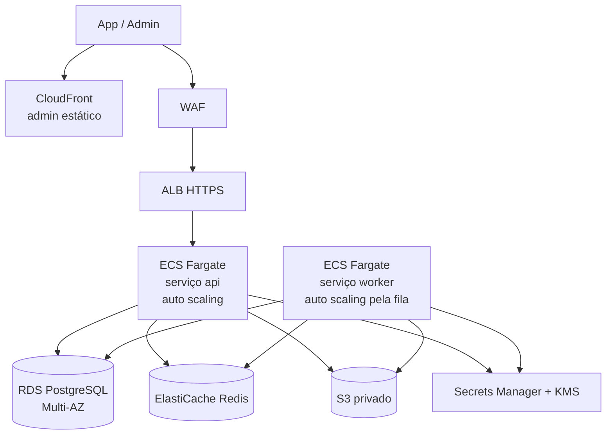

# 12 — Infraestrutura, CI/CD e monitoramento

## Ambientes (do PDF)

| Ambiente | Uso | Banco e chaves | Integrações |
|---|---|---|---|
| `dev` | Desenvolvimento local e previews | Postgres e Redis em Docker Compose; chaves de teste | Fakes ou sandboxes |
| `staging` (homologação) | Testes do cliente, TestFlight e teste interno do Play | Próprios | Stripe test mode, sandbox do agregador |
| `production` | Usuários | Próprios | Reais |

Cada ambiente tem conta AWS (ou ao menos VPC e segredos) separada **(decisão técnica: contas separadas via AWS Organizations)**.

## AWS `sa-east-1` (São Paulo)



| Peça | Serviço | Observação |
|---|---|---|
| API | ECS Fargate, serviço `api` | Auto scaling por CPU e latência; mínimo 2 tarefas em produção |
| Worker | ECS Fargate, serviço `worker` | Auto scaling pelo tamanho das filas; mesma imagem, entrypoint `worker.js` |
| Banco | RDS PostgreSQL Multi-AZ | Backups 30 dias, PITR, criptografia KMS |
| Cache/filas | ElastiCache Redis (cluster mode off, réplica) | Persistência AOF para BullMQ |
| Arquivos | S3 privado + ciclo de vida | Exportações expiram em 7 dias; mídias conforme RN-162 |
| Admin | S3 + CloudFront | Build estático |
| DNS e certificados | Route 53 + ACM | `api.<dominio>`, `admin.<dominio>`, `app.<dominio>` (universal links) |
| Infra como código | Terraform em `infra/` | Um *workspace* por ambiente |

Alternativa equivalente em Google Cloud (Cloud Run + Cloud SQL + Memorystore + GCS) aceita pelo PDF; o desenho não muda.

## CI/CD (GitHub Actions)

| Gatilho | Jobs |
|---|---|
| PR | `lint`, `typecheck`, testes unitários e de integração (Testcontainers), checagem de migração Prisma, geração do cliente OpenAPI sem diff, avaliação da Mony se `modulos/mony/**` mudou |
| Merge em `main` | Build da imagem Docker → ECR → deploy em `staging` (migração antes, ECS rolling), EAS Update no canal `staging` |
| Tag `api-vX.Y.Z` | Deploy da API em produção com aprovação manual |
| Tag `mobile-vX.Y.Z` | `eas build --profile production` + `eas submit` (App Store Connect e Play Console) |
| Correção só de JS | `eas update --channel production` (respeitando `runtimeVersion` por fingerprint) |

Migrações: sempre compatíveis com a versão anterior (expandir → migrar → contrair), porque API velha e nova convivem durante o deploy e apps antigos continuam no ar.

## App: EAS

`eas.json` com perfis:

| Perfil | Distribuição | API | Canal de update |
|---|---|---|---|
| `development` | Interna (dev client) | dev/local | — |
| `preview` | Interna (APK / ad hoc) | staging | `staging` |
| `production` | Lojas | produção | `production` |

- TestFlight e teste interno do Play para homologação (do PDF).
- OTA (EAS Update) só para JS/assets, dentro das regras das lojas. Mudança nativa = novo binário.
- Atualização do SDK do Expo: pelo menos uma vez por ano, em branch própria, com regressão completa.

## Monitoramento (do PDF)

| Item | Ferramenta |
|---|---|
| Erros do app e do servidor | Sentry (projetos `mobile`, `api`, `worker`, `admin`) com releases e source maps |
| Logs centralizados | CloudWatch Logs (JSON do pino) com `requestId`, `usuarioId` (hash) e rota |
| Métricas | Tempo de resposta e falhas por rota, tamanho e falhas de filas (BullMQ → CloudWatch/Prometheus), custo de IA por dia |
| Painel de filas | Bull Board protegido no admin |
| Analítica de produto | PostHog: cadastros, conclusão do onboarding, uso da Mony, retenção, conversão |

### Alertas para o responsável técnico

- API fora do ar (health check do ALB e uptime externo).
- Fila parada ou crescendo sem consumo.
- Falha em webhook da Stripe ou do agregador (taxa de erro ou fila de falhas > 0).
- Custo de IA do dia acima do limite configurado.
- Taxa de erro 5xx acima de 1% por 5 minutos.
- Backup diário não encontrado.

## Ambiente local

```
docker compose up -d     # postgres, redis, minio (S3), mailpit
pnpm i
pnpm --filter api prisma migrate dev && pnpm --filter api seed
pnpm dev                 # api + worker + admin
pnpm --filter mobile start  # dev client no aparelho/emulador
```
